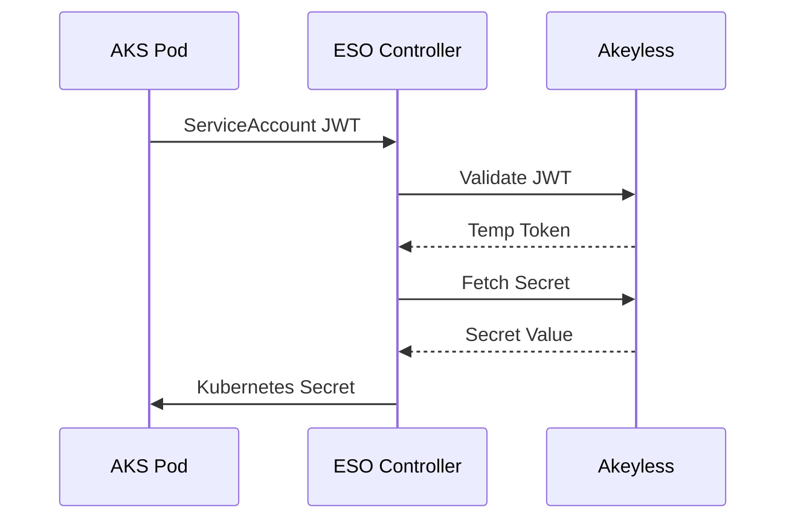

# Chapter 3 Theory

---

## Architecture Diagram

```mermaid
sequenceDiagram
  participant Pod as AKS Pod
  participant ESO as ESO Controller
  participant AK as Akeyless
  Pod->>ESO: ServiceAccount JWT
  ESO->>AK: Validate JWT
  AK-->>ESO: Temp Token
  ESO->>AK: Fetch Secret
  AK-->>ESO: Secret Value
  ESO->>Pod: Kubernetes Secret
```

---

Content missing.
